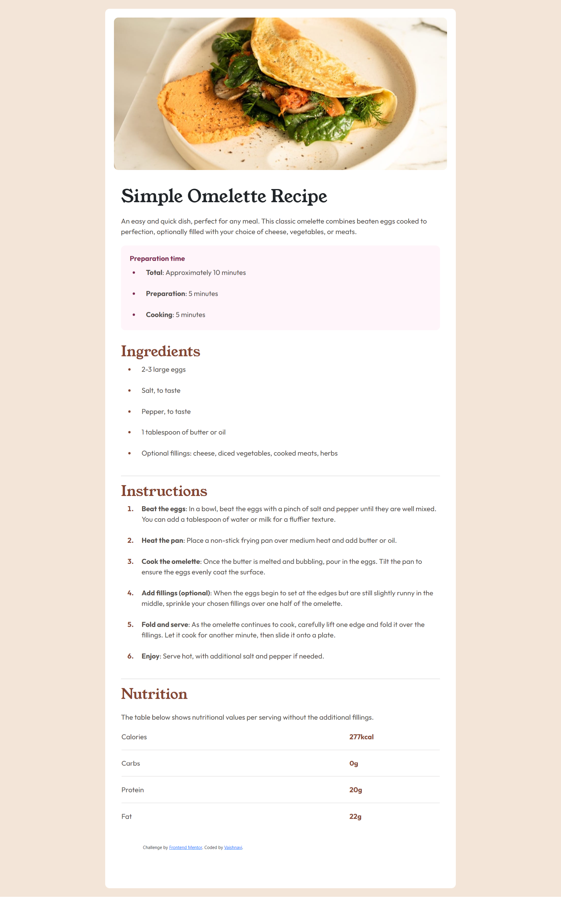

# Frontend Mentor - Recipe Page Solution

This is a solution to the [Recipe page challenge on Frontend Mentor](https://www.frontendmentor.io/challenges/recipe-page-KiTsR8QQKm). Frontend Mentor challenges help you improve your coding skills by building realistic projects.

## Table of Contents

- [Overview](#overview)
  - [Screenshot](#screenshot)
  - [Links](#links)
- [My Process](#my-process)
  - [Built with](#built-with)
  - [What I learned](#what-i-learned)
  - [Continued Development](#continued-development)
  - [Useful Resources](#useful-resources)
- [Author](#author)
- [Acknowledgments](#acknowledgments)

## Overview

### Screenshot



### Links

- Solution URL: [View Solution](https://github.com/VaishsCode/frontend-mentor-challenges/tree/main/recipe-page-main)
- Live Site URL: [View Live Site](https://vaishscode.github.io/frontend-mentor-challenges/recipe-page-main/)

## My Process

### Built with

- Semantic HTML5 markup
- CSS custom properties
- Bootstrap 5 for responsive design
- Google Fonts for typography
- Flexbox and Grid layout

### What I learned

While completing this project, I gained more experience working with semantic HTML and responsive design using Bootstrap. It helped me improve my structuring of HTML content and handle responsive layouts more effectively.

Here’s an example of a code snippet I’m proud of:

```html
<table width="100%">
  <tr>
    <td>Calories</td>
    <td class="quantity">277kcal</td>
  </tr>
  <tr>
    <td colspan="2"><hr /></td>
  </tr>
  <tr>
    <td>Carbs</td>
    <td class="quantity">0g</td>
  </tr>
  <tr>
    <td colspan="2"><hr /></td>
  </tr>
  <tr>
    <td>Protein</td>
    <td class="quantity">20g</td>
  </tr>
  <tr>
    <td colspan="2"><hr /></td>
  </tr>
  <tr>
    <td>Fat</td>
    <td class="quantity">22g</td>
  </tr>
</table>
```

### Continued development

In the future, I would like to focus more on improving accessibility features and optimizing web performance, especially in image handling for faster page loading. Additionally, I plan to explore JavaScript to add interactive elements to projects like this.

## Useful Resources

- **[Bootstrap Documentation](https://getbootstrap.com/)** - The official Bootstrap documentation was invaluable for helping me build responsive layouts.
- **[MDN Web Docs](https://developer.mozilla.org/en-US/)** - MDN provides excellent guides for understanding semantic HTML and best practices.

## Author

- **Website** - [Vaishnavi](#)
- **Frontend Mentor** - [@VaishsCode](https://www.frontendmentor.io/profile/VaishsCode)
- **GitHub** - [@VaishsCode](https://github.com/VaishsCode)

## Acknowledgments

I sincerely appreciate Frontend Mentor for offering this challenge. It has been an excellent platform for honing my skills and gaining practical experience in web development.
