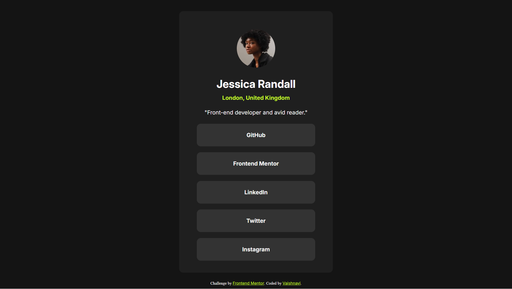

# Frontend Mentor - Social links profile solution

This is a solution to the [Social links profile challenge on Frontend Mentor](https://www.frontendmentor.io/challenges/social-links-profile-UG32l9m6dQ). Frontend Mentor challenges help you improve your coding skills by building realistic projects.

## Table of contents

- [Overview](#overview)
  - [The challenge](#the-challenge)
  - [Screenshot](#screenshot)
  - [Links](#links)
- [My process](#my-process)
  - [Built with](#built-with)
  - [What I learned](#what-i-learned)
  - [Continued development](#continued-development)
  - [Useful resources](#useful-resources)
- [Author](#author)
- [Acknowledgments](#acknowledgments)

## Overview

### The challenge

Users should be able to:

- See hover and focus states for all interactive elements on the page

### Screenshot

### Links

- Solution URL: [View Solution](https://github.com/VaishsCode/frontend-mentor-challenges/tree/main/social-links-profile-main)
- Live Site URL: [View Live Site](https://vaishscode.github.io/frontend-mentor-challenges/social-links-profile-main/)

## My process

### Built with

- Semantic HTML5 markup
- CSS custom properties
- Flexbox
- Responsive design
- [Google Fonts](https://fonts.google.com/) - For typography

### What I learned

While working on this social media profile link project, I learned how to effectively create a clean, minimalistic profile card that displays a user's information and social media links.

# Continued Development

I aim to enhance my skills in JavaScript and learn how to make the site more interactive. Additionally, I would like to explore more advanced CSS techniques, such as animations and transitions, to improve the user experience.

## Useful Resources

- **[MDN Web Docs](https://developer.mozilla.org/en-US/)** - MDN provides excellent guides for understanding semantic HTML and best practices.

## Author

- **Website** - [Vaishnavi](#)
- **Frontend Mentor** - [@VaishsCode](https://www.frontendmentor.io/profile/VaishsCode)
- **GitHub** - [@VaishsCode](https://github.com/VaishsCode)

## Acknowledgments

I sincerely appreciate Frontend Mentor for offering this challenge. It has been an excellent platform for honing my skills and gaining practical experience in web development.
